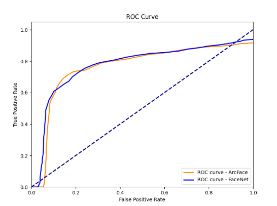

# FACEMATCH

FaceMatch is a system for identifying facial matches within an image database. With FaceMatch, users can create a database of images of people and, by uploading a new image, quickly find any matches for the person of interest within the database. 

Built with a client-server architecture using Flask-ML, FaceMatch provides structured support for efficient client-server communication tailored to ML applications.

---

# Getting started

## Prerequisites

- Python 3.12 
- Virtual environment support (recommended but optional)

## Installation

### Clone the repository

```
git clone https://github.com/RigvedManoj/FaceMatch.git
cd FaceMatch
```

### SetUp Virtual environment

```
python -m venv facematch-env
source facematch-env/bin/activate  

# On Windows: facematch-env\Scripts\activate
```

#### With Conda

```
conda create -n facematch-env python=3.12
conda activate facematch-env
```

### Install dependencies

_Run below command from root directory of project._

```
pip install -r requirements.txt
```

## Mac-specific user setup with conda/miniforge

If miniforge is not installed on your machine, please install it as below:

```
curl -L -O "https://github.com/conda-forge/miniforge/releases/latest/download/Miniforge3-MacOSX-arm64.sh"
chmod +x Miniforge3-MacOSX-arm64.sh
./Miniforge3-MacOSX-arm64.sh
```
Then set up a conda environment:
```
conda create -n facematch-env python=3.10
conda activate facematch-env
```
conda install the following:
```
conda install -c conda-forge numpy=1.24.3
conda install -c conda-forge tensorflow=2.10.0
conda install -c conda-forge pandas
conda install -c pytorch faiss-cpu
conda install -c conda-forge opencv
conda install -c conda-forge scikit-learn
conda install -c conda-forge onnxruntime
```
install the remaining dependencies:
```
pip install -r mac_requirements.txt
```

## Intel Mac x86_64 architecture specific user setup

Currently it seems that for Macs with Intel CPUs, an older version of pytorch and torchvision are required. All previous MAC setup instructions can be followed, but the following must be done to ensure the correct versions of pytorch and torchvision:

```
conda install pytorch=2.1.2 torchvision=0.16.2 -c pytorch 
```

---
## Models

link to yolov9.onnx below (best detector so far, optimized for faces)

https://drive.google.com/file/d/10lnK9ljMPihm40A3IVVNk9rz9FiLHulU/view?usp=share_link
---
# Usage

**Sample dataset to test the model:** The images in the `\resources\sample_images` folder can be used as the database, and `\resources\test_image.jpg` can be used as the query image to test the model.

## CLI

_Run all below commands from root directory of project._

### Start DB server
```
chroma run --path ./resources/data
```

### Start the FaceMatch server
```
python -m src.facematch.face_match_server
```

### Task 1: Upload images to database
```
python -m src.Sample_Client.sample_bulk_upload_client --directory_paths <path_to_directory_of_images> --collection_name <collection_name>
```
Note: The name of the collection could be a new collection you wish to create or an existing collection you wish to upload to.

_Run with Sample images directory: (Requires absolute path of directory)_

```
python -m src.Sample_Client.sample_bulk_upload_client --directory_paths <path_to_project>\resources\sample_images --collection_name test
```

### Task 2: Find matching faces
```
python -m src.Sample_Client.sample_find_face_client --file_paths <path_to_image> --collection_name <collection_name> --similarity_threshold <similarity_threshold>
```
> Note: The name of the collection needs to be an existing collection you wish to query.
> The default similarity threshold, 0.45 is used if no similarity threshold is provided.


_Run with Sample test image: (Requires absolute path of image)_

```
python -m src.Sample_Client.sample_find_face_client --file_paths <path_to_project>\resources\test_image.jpg --collection_name test_collection --similarity_threshold 0.5
```

## Rescue-Box frontend

_Run below command from root directory of project._

### Start DB server
```
chroma run --path ./resources/data
```

### Start the FaceMatch server
```
python -m src.facematch.face_match_server
```

### Use Rescue-Box-Desktop

- Install Rescue-Box from [link](https://github.com/UMass-Rescue/RescueBox-Desktop)

- Open Rescue-Box-Desktop and resgiter the model by adding the server IP address and port number in which the server is running.

- Choose the model from list of available models under the **MODELS** tab.

- Checkout the Inspect page to learn more about using the model.

---

# Metrics and Testing

We conduct a series of experiments to evaluate the performance and accuracy of FaceMatch. The experiments are conducted on a dataset of 1,680 images of people from the Labelled Faces in the Wild (LFW) dataset. 

We evaluate FaceMatch using the following metrics:

## Accuracy Testing:

_In this type of testing, all test images have a corresponding match in the database. If match is returned, it is True, otherwise False._

1. **Upload Time**: The time taken to upload images to the database.
2. **Search Time per Image**: The time taken to find matches for a single image.
3. **Faiss Accuracy (Top-n)**: The percentage of images in the database that have at least one match within the top-n results using FAISS search algorithm.  Atleast one match in top-n is considered a positive match, meaning that the person of interest is identified within the image.


### Metrics
| Face Recognition Model | Number of Faces in Database | Upload Time (in seconds) | Search Time per Image (in seconds) | Top-n | Faiss Accuracy |
|-------------------------|-----------------------------|---------------------------|------------------------------------|-------|----------------|
| ArcFace                | 1680                        | 242                       | < 1.5                              | 10    | 93.2           |
| FaceNet                | 1680                        | 463                       | < 2                                | 10    | 94             |
| VGGFace                | 1680                        | 650                       | < 3                                | 10    | 90             |


## Precision and Recall Testing (with ROC curve):

_In this type of testing, half the test images have a corresponding match in the database, the other half does not.
This helps measure True Positive, False Positive, True Negative and False Negative._

### Metrics
| Face Recognition Model | Number of Faces in Database | Threshold | Accuracy | Precision | Recall |
|------------------------|-----------------------------|-----------|----------|-----------|--------|
| ArcFace                | 840                         | 0.48      | 77       | 79        | 73     |
| FaceNet                | 840                         | 0.63      | 75       | 75        | 75     |

### ROC Curve


The above metrics were calculated using the following system configuration:

- **OS**: Windows 11 Pro 64-bit
- **Processor**: AMD Ryzen 7 7735HS with Radeon Graphics (16 CPUs), ~3.2 GHz
- **RAM**: 32 GB

## Testing

Check out [Testing README](./benchmark_testing/README.md) for complete details on dataset and testing.

Check out this [document](https://docs.google.com/document/d/1CpN__oPgmAvY65s-tWg4X-pZPCPwNEAU-ULrkdKWES4/edit?usp=sharing) for more details on the face detection and recognition models, datasets and testing.

---

# For Developers

_Run all below commands from root directory of project._

## Run unit tests

```
python -m unittest discover test
```
- #### Run individual test

```
python -m unittest test.<test_file_name>
```


